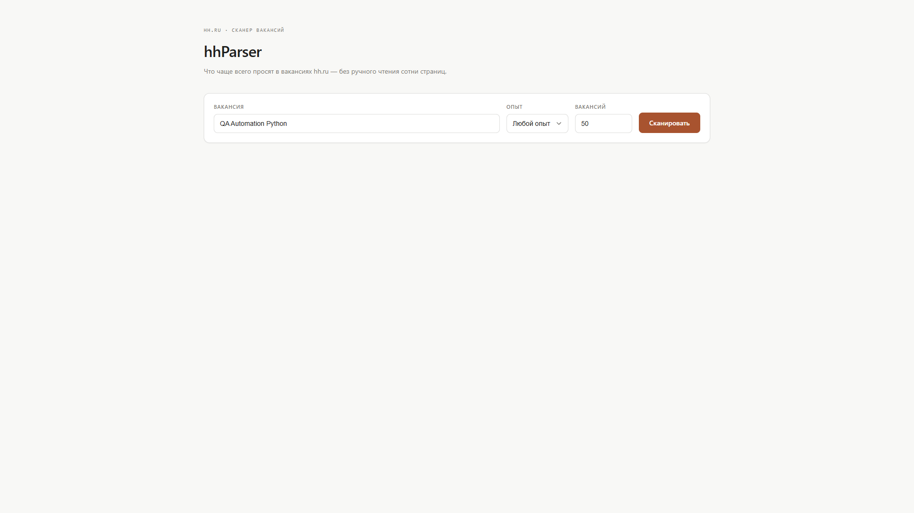
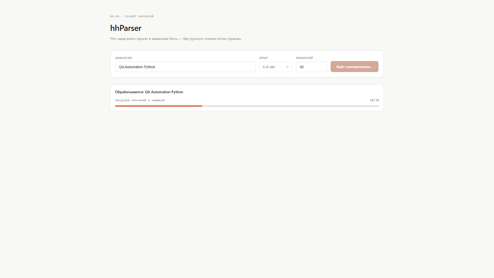
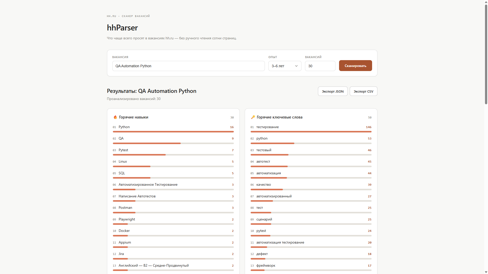

# hhParser — инструкция по запуску

## 1. Что это за программа

**hhParser** анализирует вакансии hh.ru по заданному запросу и показывает,
какие навыки и ключевые слова встречаются в описаниях чаще всего.

После запуска вы открываете веб-интерфейс, вводите название вакансии
(например, «QA Automation Python»), опционально — требуемый опыт и количество
вакансий, и получаете отчёт:

- горячие навыки — ранжированный список с частотой упоминания;
- горячие ключевые слова — то же самое по тексту описаний;
- экспорт результата в JSON или CSV.



Программа сама:

- собирает список вакансий по запросу с hh.ru;
- загружает описание и требуемые навыки по каждой вакансии;
- строит частотный анализ (с лемматизацией и биграммами);
- показывает прогресс сканирования в реальном времени.

---

## 2. Что нужно перед началом работы

Два независимых способа запуска — выберите один.

### Вариант A: Docker (рекомендуется)

Один контейнер, ничего вручную не настраивается.

- [https://www.docker.com/products/docker-desktop/](https://www.docker.com/products/docker-desktop/)
- [https://docs.docker.com/desktop/](https://docs.docker.com/desktop/)

Docker Desktop должен быть **запущен** перед стартом проекта.

### Вариант B: локально, без Docker

- Python 3.12+
- Node.js 20+

---

## 3. Получение проекта

### Вариант A — доступ к репозиторию

```bash
git clone <URL репозитория>
cd hh-parser
```

### Вариант B — zip-архив релиза

Распакуйте полученный архив (например, `hh-parser-v1.2.0.zip`) в любую
папку и откройте её в терминале.

---

## 4. Структура проекта (кратко)

- `backend/` — FastAPI: сбор данных с hh.ru, анализ, HTTP API
- `frontend/` — веб-интерфейс (React)
- `docker/` — сборка единого образа (nginx + backend в одном контейнере)
- `docker-compose.yml` — запуск всей системы

---

## 5. Запуск через Docker

1. Откройте терминал в корне проекта.
2. Выполните:

```bash
docker compose up --build
```

3. Дождитесь сборки и запуска контейнера (несколько минут при первом запуске).
4. Откройте в браузере:

```
http://localhost:8080
```

### Как понять, что всё работает

- контейнер запущен (`docker ps`);
- страница `http://localhost:8080` открывается;
- после ввода запроса и завершения сканирования отображается отчёт.

Во время сканирования отображается прогресс:



По завершении — отчёт с горячими навыками и ключевыми словами:



---

## 6. Запуск без Docker (backend + frontend раздельно)

Два процесса, два терминала.

### Backend

```bash
cd backend
python -m venv .venv
.venv\Scripts\activate        # Linux/macOS: source .venv/bin/activate
pip install -r requirements.txt
uvicorn app.main:app --reload --port 8000
```

### Frontend (отдельный терминал)

```bash
cd frontend
npm ci
npm run dev
```

Откройте `http://localhost:5173`. Vite проксирует запросы `/api` на
`localhost:8000` — CORS в `backend/app/main.py` уже настроен именно на
этот порт, менять ничего не нужно.

**Отличие от Docker-запуска:** nginx здесь не используется, оба процесса
работают напрямую. Кеш HTML-страниц пишется в `backend/.cache` — та же
папка, что и в контейнере, но без изоляции.

---

## 7. Обновление до новой версии

Актуально только для Docker-запуска — при локальном запуске из git
достаточно `git pull` и переустановки зависимостей при изменении
`requirements.txt`/`package.json`.

### Если проект получен через git

```bash
git pull
docker compose down
docker compose build --no-cache
docker compose up -d
```

### Если проект получен как zip-архив

1. Остановите текущий контейнер:

   ```bash
   docker compose down
   ```

2. Скачайте новый архив релиза и распакуйте его **поверх старой папки**,
   заменив все файлы (или в новую папку — тогда просто откройте терминал
   в ней).
3. Соберите и запустите обновлённый образ:

   ```bash
   docker compose up --build -d
   ```

> ⚠️ Без пересборки (`--build` / `--no-cache`) Docker может использовать
> старый образ, и изменения не применятся.

---

## 8. Как остановить программу

Docker:

```bash
docker compose down
```

Локально: `Ctrl+C` в обоих терминалах.

---

## 9. Ограничения

- Программа предназначена только для анализа вакансий и не выполняет
  никаких действий на hh.ru.
- Незавершённое сканирование теряется при перезапуске backend-процесса
  (job-стейт в памяти, не в БД).
- Кеш загруженных страниц (`backend/.cache`) самоочищается по TTL (24 часа)
  и не переживает пересборку/перезапуск образа — рассчитан на это, отдельная
  настройка не предусмотрена.
- Изменение файлов `backend/app/data/stopwords.txt` и `skill_aliases.json`
  требует пересборки образа (Docker) или перезапуска backend (локально).